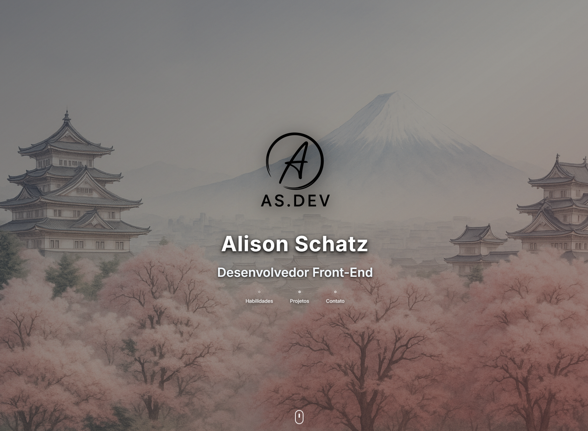

# AS.DEV — Portfólio Pessoal

> "O caminho do desenvolvedor: códigos limpos, soluções elegantes."

Um portfólio moderno com inspiração na estética japonesa, desenvolvido com foco em performance, acessibilidade e design responsivo utilizando **React** e **Tailwind CSS**.

---

## 🔗 Demonstração

[→ Ver Portfólio Online](https://as-dev-portfolio.vercel.app)

---

## ✨ Destaques

- Design refinado com influências visuais japonesas
- Totalmente responsivo para todos os dispositivos
- Animações suaves e interações leves
- Alta performance e carregamento otimizado
- Estrutura semântica e acessível
- Scrollbar oculta para uma experiência visual limpa

---

## 🧱 Tecnologias

### Frontend

- React — biblioteca para construção de interfaces
- Tailwind CSS — framework utilitário para estilização
- Lucide React — biblioteca de ícones vetoriais

### Ferramentas

- Vite — ferramenta de build rápida e moderna
- ESLint — análise estática para qualidade do código
- Prettier — padronização de estilo de código

---

## ⚙️ Instalação

### Pré-requisitos

- Node.js (versão 16 ou superior)
- npm ou yarn

### Passos

```bash
# Clone o repositório
git clone https://github.com/alisonschatz/as-dev-portfolio

# Acesse a pasta do projeto
cd as-dev-portfolio

# Instale as dependências
npm install

# Inicie o servidor local
npm run dev
```

---

## 📜 Scripts Disponíveis

```bash
npm run dev       # Inicia o ambiente de desenvolvimento
npm run build     # Cria a versão de produção
npm run preview   # Visualiza a build localmente
npm run lint      # Analisa o código
npm run format    # Formata o código
```

---

## 📁 Estrutura

```
src/
├── components/
│   ├── Portfolio.jsx
│   └── sections/
│       ├── HeroSection.jsx
│       ├── SkillsSection.jsx
│       ├── ProjectsSection.jsx
│       ├── ContactSection.jsx
│       └── Footer.jsx
├── styles/
│   └── index.css
├── App.js
└── index.js

public/
├── logo.png
├── hero_back.png
├── skills_back.jpg
├── contact_back.jpg
├── skills/
│   ├── html5.svg
│   ├── css.svg
│   ├── javascript.svg
│   └── ...
└── projects/
    ├── calculator-app.jpg
    ├── age-calculator.jpg
    └── ...
```

---

## 🎨 Personalização

### Cores e temas

As cores estão definidas em `tailwind.config.js`:

```js
module.exports = {
  theme: {
    extend: {
      colors: {
        primary: '#dc2626',
        secondary: '#f59e0b',
        accent: '#3b82f6',
      },
    },
  },
};
```

### Conteúdo dinâmico

- **Projetos**: Edite o array `projects` em `ProjectsSection.jsx`
- **Habilidades**: Atualize o array `skills` em `SkillsSection.jsx`
- **Contato**: Ajuste os dados em `ContactSection.jsx`

---

## 🚀 Deploy

### Vercel (recomendado)

```bash
npm i -g vercel
vercel
```

### Netlify

```bash
npm run build
# Faça upload da pasta 'dist/' via painel da Netlify
```

---

## 📊 Performance

- Lighthouse: 95+ em todas as métricas
- First Contentful Paint: < 1.5s
- Responsividade total
- Acessibilidade nota A+

---

## 🤝 Contribuições

Contribuições são bem-vindas! Siga os passos:

1. Fork este repositório  
2. Crie uma branch:  
   `git checkout -b feature/NomeDaFeature`
3. Commit:  
   `git commit -m "Adiciona nova feature"`
4. Push:  
   `git push origin feature/NomeDaFeature`
5. Abra um Pull Request

---

## 📄 Licença

Distribuído sob licença MIT. Veja [LICENSE](LICENSE) para mais informações.

---

## 📬 Contato

**Alison Schatz** — Desenvolvedor Front-End

- Portfólio: [as-dev-portfolio.vercel.app](https://as-dev-portfolio.vercel.app)
- LinkedIn: [linkedin.com/in/alison-schatz](https://linkedin.com/in/alison-schatz)
- Email: [alisonschatz1@gmail.com](mailto:alisonschatz1@gmail.com)
- WhatsApp: [+55 47 99293-5133](https://wa.me/5547992935133)
- GitHub: [github.com/alisonschatz](https://github.com/alisonschatz)

---

<div align="center">
⭐ Se este projeto te ajudou, considere deixar uma estrela.  
Feito com dedicação e café por Alison Schatz.
</div>
